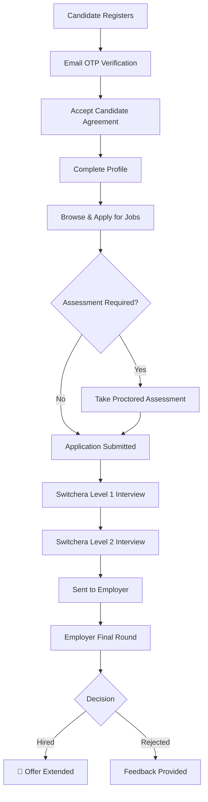

<p align="center">
  
</p>

<h1 align="center">Switchera</h1>

<p align="center">
  <strong>Where Verified Talent Meets Trusted Employers</strong>
</p>

<p align="center">
  
  
  
  
  
  
</p>

---

## 📖 Overview

**Switchera** is a full-stack verified professional hiring platform that replaces traditional resumes with verified skills, rigorous assessments, and multi-level validations. Unlike typical job boards, Switchera acts as a trusted intermediary — conducting its own skill assessments, proctored exams, and validation interviews before connecting candidates with employers.

### The Problem

Traditional hiring is broken:
- Resumes are unverified and often exaggerated
- Employers waste time screening unqualified candidates
- Candidates with real skills get lost in keyword-filtered ATS systems
- No accountability for no-shows, fake credentials, or interview ghosting

### The Switchera Solution

Switchera introduces a **trust-first hiring model**:

1. **Candidates** register, build verified profiles, accept a binding agreement, and take proctored skill assessments
2. **Switchera** validates credentials, conducts multi-level interviews, and certifies candidates
3. **Employers** receive only pre-vetted, assessment-scored, and interview-validated candidates
4. **Accountability** — candidates who cheat, ghost, or submit fake details face warnings, temporary restrictions, or permanent bans

---

## ✨ Key Features

### 🎯 For Candidates
| Feature | Description |
|---|---|
| **Verified Profiles** | Complete profiles with education, work experience, skills, and documents — all subject to verification |
| **Skill Assessments** | Proctored MCQ + short-answer exams with camera/microphone monitoring and anti-cheat detection |
| **Switchera Certifications** | Earn skill badges after passing assessments (e.g., "✅ Switchera Certified — Python 92%") |
| **Job Search & Apply** | Browse jobs, apply with cover letters or video cover letters, and track application status |
| **Interview Calendar** | Schedule Switchera validation interviews with available time slots |
| **Candidate Agreement** | Digital agreement enforcing truthful information, no-cheating policy, and joining commitment |
| **Dashboard** | Track applications, assessment scores, certifications, and profile completeness |

### 🏢 For Employers
| Feature | Description |
|---|---|
| **Post Jobs** | Create detailed job listings with required skills, salary ranges, experience levels, and assessment requirements |
| **Pre-Vetted Applicants** | View only candidates who have passed Switchera's assessment and verification pipeline |
| **Smart Matching** | AI-powered candidate matching based on skills, experience, location, and assessment scores |
| **Applicant Management** | Review applications, assessment results, video cover letters, and interview recordings |
| **Messaging** | In-platform messaging with candidates throughout the hiring process |
| **Dashboard** | Overview of active jobs, applicant pipeline, and hiring analytics |

### 🛡️ For Admins (Switchera Team)
| Feature | Description |
|---|---|
| **Candidate Management** | View, verify, warn, restrict, or ban candidates |
| **Interview Pipeline** | Manage Level 1 & Level 2 validation interviews, record results, flag cheating |
| **Platform Analytics** | Track page views, registrations, and platform usage |
| **Super Admin Controls** | Multi-admin support with super admin privileges for critical actions |

### 🔒 Assessment & Proctoring System
- **70% MCQ / 30% Short-Answer** question split
- **Randomized answer positions** — correct answers are shuffled, never fixed to one position
- **Large diverse question pools** — 10-15 questions per skill to minimize repetition
- **Camera + Microphone required** — assessment cannot start without granting both permissions
- **Tab-switch detection** — tracks when candidates leave the assessment window
- **Timed assessments** — configurable time limits with automatic submission
- **Skill-specific pools** — Python, JavaScript, React, SQL, Node.js, AWS, Kubernetes, ML, Data Analysis, and more

---

## 🏗️ Architecture

```
switchera/
├── public/                     # Static assets (logo, favicon)
├── src/                        # React frontend (Vite)
│   ├── api/
│   │   └── client.js           # API client with auth token management
│   ├── components/
│   │   └── Layout/
│   │       ├── Navbar.jsx      # Navigation bar with role-based links
│   │       └── Layout.jsx      # App shell with sidebar
│   ├── context/
│   │   └── AuthContext.jsx     # Authentication context provider
│   ├── pages/
│   │   ├── Landing.jsx         # Public landing page
│   │   ├── Auth/
│   │   │   ├── Login.jsx       # Login with OTP verification
│   │   │   └── Register.jsx    # Multi-step registration (role selection → details → OTP)
│   │   ├── Candidate/
│   │   │   ├── Dashboard.jsx   # Candidate home dashboard
│   │   │   ├── Profile.jsx     # Profile editor (education, experience, skills, resume)
│   │   │   ├── JobSearch.jsx   # Job search with filters
│   │   │   ├── JobDetail.jsx   # Job detail + apply
│   │   │   ├── Applications.jsx # Track applied jobs
│   │   │   ├── Agreement.jsx   # Digital candidate agreement
│   │   │   ├── Certifications.jsx # Switchera skill certifications
│   │   │   ├── Availability.jsx   # Interview availability scheduler
│   │   │   └── InterviewCalendar.jsx # Switchera interview calendar
│   │   ├── Employer/
│   │   │   ├── Dashboard.jsx   # Employer home dashboard
│   │   │   ├── PostJob.jsx     # Job posting form
│   │   │   ├── ManageJobs.jsx  # Active/paused/closed jobs
│   │   │   ├── Applicants.jsx  # Applicant review & management
│   │   │   └── MatchingCandidates.jsx # AI-matched candidates
│   │   ├── Admin/
│   │   │   ├── Dashboard.jsx   # Admin analytics dashboard
│   │   │   ├── Candidates.jsx  # Candidate management
│   │   │   ├── Pipeline.jsx    # Interview pipeline tracker
│   │   │   └── Interviews.jsx  # Interview validation management
│   │   ├── Assessment/
│   │   │   └── TakeAssessment.jsx # Full-screen proctored assessment
│   │   └── Feedback/
│   │       └── ManagerFeedback.jsx # Manager reference form
│   └── styles/
│       ├── variables.css       # Design system tokens
│       ├── globals.css         # Global styles & component classes
│       └── animations.css      # Micro-animations & transitions
├── server/                     # Express.js backend
│   ├── index.js                # Server entry point
│   ├── config/
│   │   └── agreement.js        # Candidate agreement clauses
│   ├── db/
│   │   ├── schema.js           # SQLite schema (15+ tables)
│   │   └── seed.js             # Demo data seeder (100 candidates, 50 jobs, 5 employers)
│   ├── middleware/
│   │   └── auth.js             # JWT authentication middleware
│   └── routes/
│       ├── auth.js             # Registration, login, OTP verification
│       ├── candidates.js       # Profile CRUD, resume upload, AI parsing
│       ├── jobs.js             # Job CRUD with search & filters
│       ├── applications.js     # Apply, track, update applications
│       ├── assessments.js      # Generate, take, submit, score assessments
│       ├── certifications.js   # Skill certification management
│       ├── employers.js        # Employer profile management
│       ├── admin.js            # Admin candidate management & actions
│       ├── pipeline.js         # Interview pipeline (L1, L2, employer round)
│       ├── interviews.js       # Interview scheduling & recordings
│       ├── agreement.js        # Candidate agreement acceptance
│       ├── messages.js         # In-platform messaging
│       ├── feedback.js         # Manager feedback/references
│       └── analytics.js        # Platform analytics tracking
├── index.html                  # Vite entry point
├── vite.config.js              # Vite configuration
├── package.json                # Dependencies & scripts
├── render.yaml                 # Render deployment config
└── .env.example                # Environment variable template
```

---

## 🗄️ Database Schema

Switchera uses **SQLite** (via `better-sqlite3`) with **15+ tables**:

| Table | Purpose |
|---|---|
| `users` | Authentication (email, password hash, role: candidate/employer/admin) |
| `candidate_profiles` | Full candidate profile with verification status, agreement acceptance, penalties |
| `education` | Education history with document verification |
| `work_experience` | Employment history with verification |
| `skills` | Skill list with proficiency levels and assessment scores |
| `employer_profiles` | Company information, logo, industry, size |
| `jobs` | Job listings with required skills, salary, assessment config |
| `applications` | Job applications with status tracking through the full pipeline |
| `assessments` | Proctored assessments with questions, answers, scores, and violation tracking |
| `candidate_certifications` | Switchera-issued skill certifications |
| `interview_pipeline` | Multi-level interview tracking (L1 → L2 → Employer) |
| `truehire_interviews` | Scheduled interviews with video recordings |
| `candidate_agreements` | Signed agreement records with version and timestamp |
| `manager_feedback` | Manager references and ratings |
| `messages` | In-platform communication between candidates and employers |
| `otp_codes` | OTP verification codes for login/registration |
| `admin_actions` | Audit log of all admin actions (warnings, bans, etc.) |
| `candidate_availability` | Candidate interview availability slots |
| `platform_analytics` | Page views and usage tracking |

---

## 🛠️ Tech Stack

| Layer | Technology |
|---|---|
| **Frontend** | React 19.1, React Router 7, Vite 8 |
| **Styling** | Vanilla CSS with custom design system (variables, animations, glassmorphism) |
| **Backend** | Express 5.2 (Node.js, ES Modules) |
| **Database** | SQLite 3 via `better-sqlite3` (WAL mode, foreign keys) |
| **Authentication** | JWT tokens + OTP email verification (Nodemailer) |
| **File Uploads** | Multer (resumes, avatars, video cover letters) |
| **AI Integration** | Google Generative AI (`@google/generative-ai`) for resume parsing |
| **Security** | bcryptjs password hashing, express-rate-limit, CORS |
| **Deployment** | Render (Node.js web service) |

---

## 🚀 Getting Started

### Prerequisites

- **Node.js** ≥ 18.x
- **npm** ≥ 9.x

### Installation

```bash
# Clone the repository
git clone https://github.com/Siingh-bit/TrueHire.git
cd TrueHire

# Install dependencies
npm install

# Set up environment variables
cp .env.example .env
# Edit .env with your values (JWT_SECRET, SMTP credentials, etc.)
```

### Running Locally

```bash
# Start both frontend (Vite) and backend (Express) concurrently
npm start

# Or run them separately:
npm run dev      # Frontend on http://localhost:5173
npm run server   # Backend on http://localhost:3001
```

The database is automatically initialized and seeded with demo data on first run.

### Demo Accounts

All demo accounts use password: `password123`

| Role | Email | Description |
|---|---|---|
| **Candidate** | `priya.sharma@email.com` | Pre-verified candidate with full profile |
| **Employer** | `hr@technova.com` | TechNova Solutions HR account |
| **Admin** | `admin@switchera.com` | Super admin with full platform access |

> **Note:** 100 additional candidate accounts (`candidate1@email.com` through `candidate100@email.com`) and 4 more employer accounts are seeded automatically.

---

## 📝 Environment Variables

| Variable | Required | Default | Description |
|---|---|---|---|
| `NODE_ENV` | No | `development` | `development` returns OTPs in API response; `production` sends via email only |
| `PORT` | No | `3001` | Express server port |
| `JWT_SECRET` | **Yes** | — | Secret key for signing JWT tokens |
| `SMTP_HOST` | No | — | SMTP server host (e.g., `smtp.gmail.com`) |
| `SMTP_PORT` | No | — | SMTP port (e.g., `587`) |
| `SMTP_USER` | No | — | SMTP username/email |
| `SMTP_PASS` | No | — | SMTP password or app password |

> In `development` mode, OTP codes are returned in the API response so you don't need a real email setup for local testing.

---

## 🌐 Deployment

### Render (Current)

The project includes a `render.yaml` for one-click deployment:

```yaml
services:
  - type: web
    name: switchera
    runtime: node
    plan: free
    buildCommand: npm install && npm run build
    startCommand: node server/index.js
    envVars:
      - key: NODE_ENV
        value: production
```

> ⚠️ **Render Free Tier Limitation:** The free plan uses an ephemeral filesystem. The SQLite database resets on every deploy or server sleep cycle. For production, consider migrating to a cloud database (Supabase, Neon PostgreSQL, or PlanetScale).

### Build for Production

```bash
# Build the frontend
npm run build

# The Express server serves the built frontend in production
node server/index.js
```

---

## 🔐 API Reference

All API endpoints are prefixed with `/api`. Authentication is via `Authorization: Bearer <token>` header.

### Authentication
| Method | Endpoint | Description |
|---|---|---|
| `POST` | `/api/auth/register` | Register new candidate/employer |
| `POST` | `/api/auth/verify-otp` | Verify OTP code |
| `POST` | `/api/auth/login` | Login with email + password |
| `GET` | `/api/auth/me` | Get current user profile |

### Candidates
| Method | Endpoint | Description |
|---|---|---|
| `GET` | `/api/candidates/profile` | Get candidate profile |
| `PUT` | `/api/candidates/profile` | Update profile fields |
| `POST` | `/api/candidates/education` | Add education entry |
| `POST` | `/api/candidates/experience` | Add work experience |
| `POST` | `/api/candidates/skills` | Add skill |
| `POST` | `/api/candidates/resume` | Upload resume (PDF) |
| `POST` | `/api/candidates/avatar` | Upload profile photo |

### Jobs
| Method | Endpoint | Description |
|---|---|---|
| `GET` | `/api/jobs` | List jobs (with search, filters, pagination) |
| `GET` | `/api/jobs/:id` | Get job details |
| `POST` | `/api/jobs` | Create job (employer only) |
| `PUT` | `/api/jobs/:id` | Update job |
| `GET` | `/api/jobs/:id/matching` | Get matching candidates for a job |

### Applications
| Method | Endpoint | Description |
|---|---|---|
| `POST` | `/api/applications` | Apply for a job |
| `GET` | `/api/applications` | List applications (role-filtered) |
| `PUT` | `/api/applications/:id/status` | Update application status |

### Assessments
| Method | Endpoint | Description |
|---|---|---|
| `POST` | `/api/assessments/generate/:appId` | Generate assessment for application |
| `GET` | `/api/assessments/:id` | Get assessment details |
| `PUT` | `/api/assessments/:id/start` | Start assessment (requires camera/mic) |
| `PUT` | `/api/assessments/:id/submit` | Submit answers and get score |
| `PUT` | `/api/assessments/:id/violation` | Report proctoring violation |

### Admin
| Method | Endpoint | Description |
|---|---|---|
| `GET` | `/api/admin/candidates` | List all candidates with filters |
| `PUT` | `/api/admin/candidates/:id/verify` | Verify/reject candidate |
| `POST` | `/api/admin/candidates/:id/action` | Warn, restrict, or ban candidate |
| `GET` | `/api/admin/stats` | Platform statistics |

---

## 🎨 Design System

Switchera uses a custom CSS design system with:

- **CSS Custom Properties** for theming (dark mode with vibrant accents)
- **HSL Color Palette** — Primary blue (`#2d79f2`), accent purple (`#8b2dff`), gradients
- **Glassmorphism** — Frosted-glass cards with backdrop blur
- **Micro-animations** — Fade-in-up, scale, pulse, and reveal-on-scroll effects
- **Responsive Layout** — Mobile-first grid system
- **Component Classes** — `.card`, `.btn`, `.badge`, `.stat-card`, `.form-group`, etc.

---

## 📄 Application Flow



---

## 🤝 Contributing

Switchera is currently in **private beta / testing phase**. Contributions are not open to the public at this time.

---

## 📜 License

This project is proprietary software. All rights reserved.

© 2026 Switchera. Unauthorized copying, modification, distribution, or use of this software is strictly prohibited.

---

<p align="center">
  <strong>Built with ❤️ by the Switchera Team</strong><br/>
  <em>Where Merit Wins.</em>
</p>
